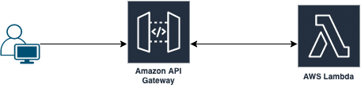

# Welcome to your CDK TypeScript project!

## Q&A about CDK Pipeline
### 1. What is CDK pipelines?
	CDK pipeline powered by AWS CodePipeline, it is a high-level construct library that helps to make CD pipeline for CDK application.
    CodePipeline is the most construct in CDK Pipeline, which configures a CodePipeline pipeline to deploy CDK application.
    A CDK Pipeline starts with several predefined stages and actions, but users can add more stages and actions to suite the need of application.
### 2. What does it bring to the CI/CD process?
    by define CDK pipeline in the CDK application, developer can easy provision, customize and modify Code Pipeline pipeline. We can configuration a CodePipeline pipeline to running CICD pipeline for CDK application with more customization

### 3. What are its advantages and disadvantages?
 Below are AWS CDK advantages and disadvantages when I research on internet and first touch to make a example project to deploy Slack Lambda Function:
	Advantages:
        - Deploy resource (mean all AWS Services), infra and application faster
        - Great when doing initial development and testing but with production need more reliable, automated pipeline
        - Native in AWS Services => easy to deploy and integrate with another AWS Services
        - Easy rolback infrastructure with Cloudformation (Cannot do if using Terraform)
        - No need much document for tranfer
        - Easy to deploy with multiple region
    Disadvantages:
        - Only use with resources in AWS then limited if you also using multiple cloud like Google, Azure
        - Limited by CodePipeline such as limited connect to SCM because only support Github, Bitbucket, CodeCommit, S3, ECR.
        - Cannot deploy to annother cloud because only support deploy to AWS services.
        - Hard for DevOps Engineers if they start form System Admin to DevOps Engineer (All most guys from system admin familier with shell than programing language or have use but almost create with basic features)

### 4. Would you suggest using it? In which cases? Why?
    Yes, CDK very cool when I try to make a example.
    But, It's very good if you only use AWS for your applicaition because it native very fast but for another cloud we can think another solution. (Example: We can use Jenkins for trigger deploy to another cloud or using Jenkins for deploy)

Current Project Issue:
[ ] Deploy app have issue because do not get the artifactory file to deploy to Lambda Function

# Architecture

## Useful commands

 * `npm run build`   compile typescript to js
 * `npm run watch`   watch for changes and compile
 * `npm run test`    perform the jest unit tests
 * `cdk deploy`      deploy this stack to your default AWS account/region
 * `cdk diff`        compare deployed stack with current state
 * `cdk synth`       emits the synthesized CloudFormation template
